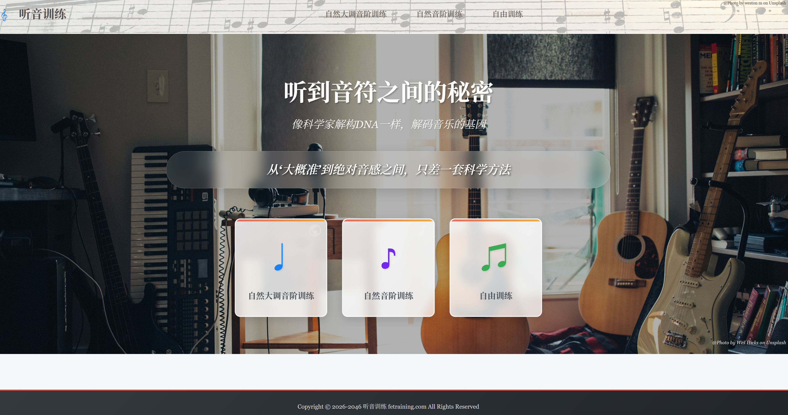
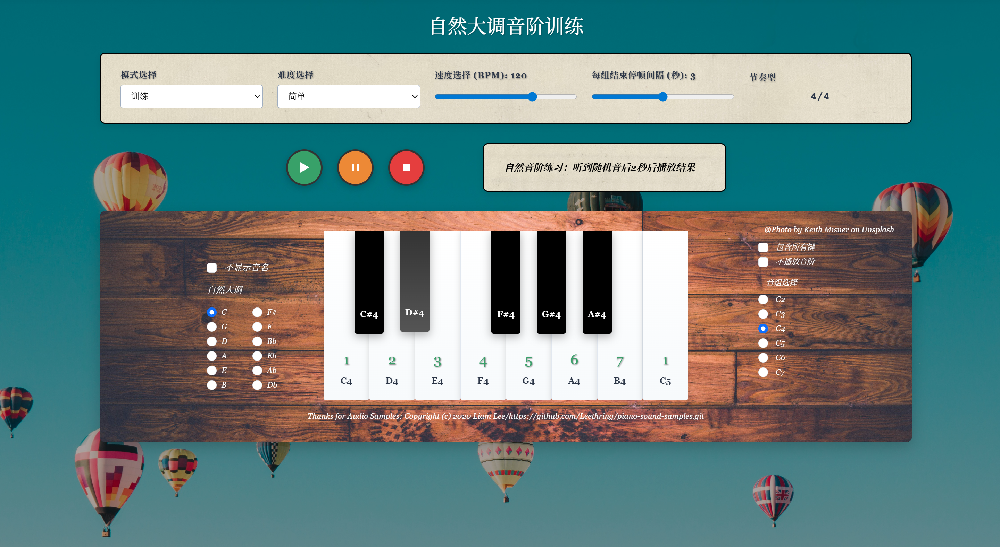

# Sound Training (听音训练)

An interactive music ear training application based on Flask, helping users improve their musical hearing abilities through scientific methods.

## 🎯 Project Introduction

This project aims to help music enthusiasts, students, and professional musicians improve their ear training abilities through systematic training, from "approximately accurate" to precise pitch recognition, and even developing absolute pitch.
Currently, all natural major scale ear training has been completed, and the author will continue to improve other professional training needs in the future.

### Core Philosophy
- Music is not just heard, it's deconstructed
- Your ears can be as precise as your eyes
- Between 'approximately accurate' and absolute pitch, there's only one scientific method

## ✨ Features

### Training Modes
- **Natural Major Scale Training**: Focus on pitch recognition of natural major scales

### Page Preview

#### Homepage


#### Scale Training Page


### Technical Features
- Interactive piano interface
- High-quality audio samples
- Responsive design, supporting multiple device access
- Intuitive user interface

## 🛠️ Technology Stack

### Backend
- Python 3.x
- Flask 2.0.0+

### Frontend
- HTML5
- CSS3
- JavaScript
- Bootstrap 5.3.0

### Audio Resources
- High-quality piano audio samples
- Complete 88-key piano pitch coverage

## 📦 Installation and Running

### One-Click Launch (Recommended)

Double-click **`一键启动.bat`** in the project root directory. The script will automatically:
1. Check Python environment
2. Install project dependencies
3. Start the Flask server
4. Open the browser to the training page

### Manual Setup

1. **Clone the repository**
   ```bash
   git clone https://github.com/yourusername/sound_training.git
   cd sound_training
   ```

2. **Install dependencies**
   ```bash
   pip install -r requirements.txt
   ```

3. **Run the application**
   ```bash
   python app.py
   ```

4. **Access the application**
   Open your browser and visit http://127.0.0.1:5000

## 📁 Project Structure

```
sound_training/
├── 一键启动.bat            # One-click launch script (recommended)
├── app.py                 # Flask application main file
├── requirements.txt       # Project dependencies
├── README.md              # Project documentation
├── static/                # Static files
│   ├── audio/             # Audio files
│   │   ├── piano/         # Piano audio samples
│   │   └── voice/         # Solfege voice recordings
│   ├── css/               # CSS style files
│   ├── js/                # JavaScript files
│   └── images/            # Image resources
└── templates/             # HTML template files
    ├── index.html         # Homepage
    ├── c_major_scale.html # Natural major scale training page
    ├── natural_scale_training.html # Natural scale training page
    ├── free_training.html # Free training page
    └── piano_test.html    # Piano test page
```

## 🎵 Audio Resources

The project includes complete 88-key piano audio samples, covering:
- Basic pitches (C, D, E, F, G, A, B)
- Sharps and flats (# and b)
- Different octaves

## 📄 License

This project is licensed under the **CC BY-NC 4.0 License** (Creative Commons Attribution-NonCommercial 4.0 International License).

### License Terms
- ✅ **Allowed**: Personal use, educational purposes, non-commercial projects, modification and distribution
- ❌ **Prohibited**: Commercial use
- ⚠️ **Required**: Must attribute the original author

### Detailed Information
Please refer to the [CC BY-NC 4.0 License](https://creativecommons.org/licenses/by-nc/4.0/) for complete terms.

## 🤝 Contribution

Welcome to submit Issues and Pull Requests to help improve this project!

### Contribution Guide
1. Fork this repository
2. Create your feature branch (`git checkout -b feature/amazing-feature`)
3. Commit your changes (`git commit -m 'Add some amazing feature'`)
4. Push to the branch (`git push origin feature/amazing-feature`)
5. Open a Pull Request

## 📞 Contact

If you have any questions or suggestions, please feel free to contact:

## 🙏 Acknowledgments

- Audio samples: Thanks to contributors who provided high-quality piano audio, all open source projects used are displayed on the website
- Design inspiration: @Photo by weston m on Unsplash
- Background image: @Photo by Wes Hicks on Unsplash

---

**Enjoy music, enjoy training!** 🎶